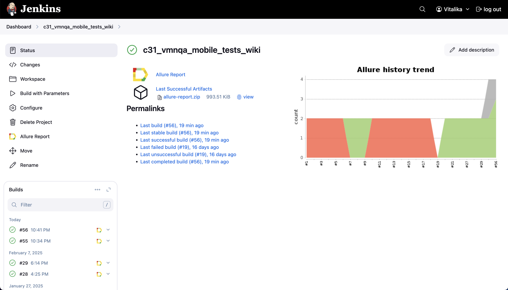
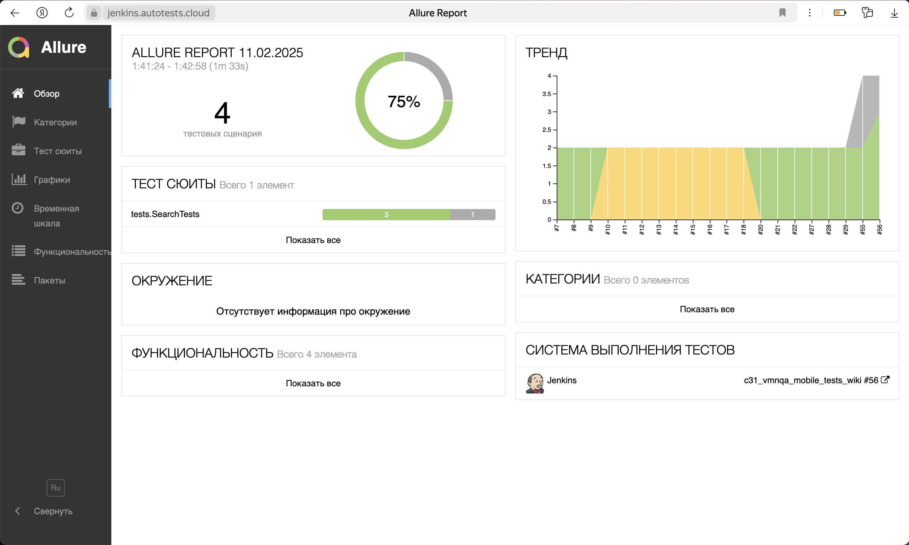
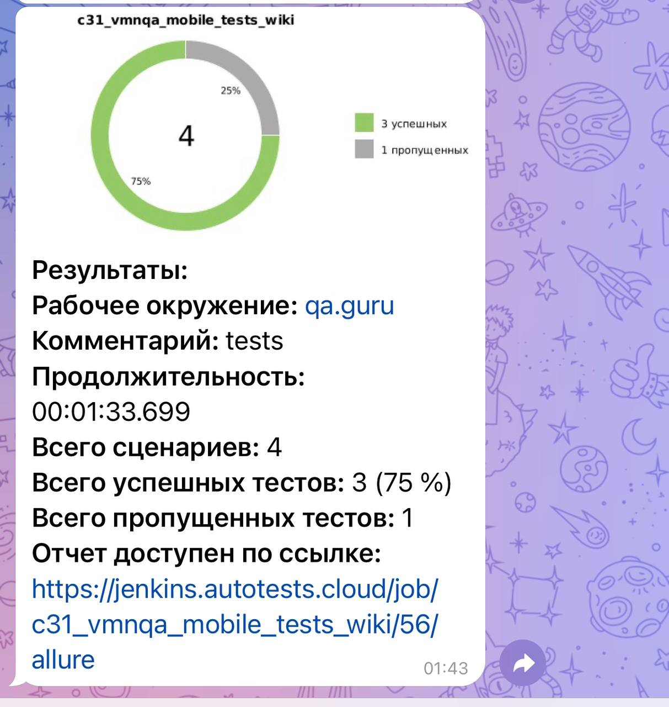
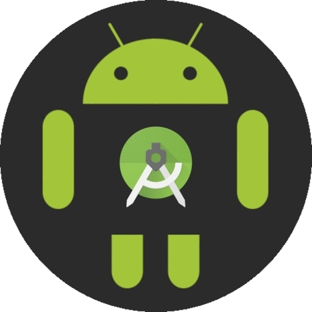

<h1 align="center">Проект по автоматизации тестирования мобильного приложения Wikipedia</h1>
<p align="center">
<a href="https://ru.wikipedia.org/"></a>
</p>


##  Содержание:
- <a href="#cases"> Тест-кейсы</a>
- <a href="#autotests"> Запуск автотестов</a>
- <a href="#jenkins"> Сборка в Jenkins</a>
- <a href="#allureReport"> Пример Allure-отчета</a>
- <a href="#tg"> Уведомления в Telegram с использованием бота</a>
- <a href="#movie">Видеопример прохождения тестов Browserstack</a>
- <a href="#movie1">Видеопример прохождения тестов локально на эмуляторе</a>


Тесты написаны на языке <code>Java</code> с использованием фреймворка для автоматизации тестирования <code>[Selenide](https://selenide.org/)</code>, сборщик - <code>Gradle</code>.

<code>JUnit 5</code> задействован в качестве фреймворка модульного тестирования.

Для локального тестирования приложения на мобильных устройствах используется <code>Android Studio</code> и <code>Appium</code>.
Для удаленного тестирования в различных платформах <code>Browserstack</code>

Для удаленного запуска реализована джоба в <code>Jenkins</code> с формированием Allure-отчета
и отправкой результатов в <code>Telegram</code> при помощи бота.

____
<a id="cases"></a>
## 🕵️‍♂️ Тест-кейсы
### При запуске локально на эмуляторе и удаленно на Browserstack:
- Вывод результатов поиска
- Открытие первого результата и проверка названия статьи
- Проверка экранов онбординга


____
<a id="autotests"></a>
## ▶️ Команда для запуска автотестов из терминала

Запуск локально на эмуляторе:
```bash 
gradle clean android_tests -DdeviceHost=emulation
```
> Для запуска локальных тестов на компьютере должны быть установлены Android Studio, Appium Server и Appium

Запуск удаленно на Browserstack:
```bash 
gradle clean android_tests -DdeviceHost=browserstack
```
---
<a id="jenkins"></a>
##  </a> Сборка в <a target="_blank" href="https://jenkins.autotests.cloud/job/c31_vmnqa_mobile_tests_wiki/"> Jenkins </a>
Для доступа в Jenkins необходима регистрация на ресурсе [Jenkins](https://jenkins.autotests.cloud/) 
Для запуска сборки необходимо нажать кнопку <code>Build now</code>.
<p align="center">

</p>
После выполнения сборки, в блоке <code>Build History</code> напротив номера сборки появятся значки 
<code>Allure Report</code>, при клике на которые откроется страница с сформированным html-отчетом.

____
<a id="allureReport"></a>
##  </a> Пример <a target="_blank" href="https://jenkins.autotests.cloud/job/c31_vmnqa_mobile_tests_wiki/56/allure/"> Allure-отчета </a>
<p align="center">

</p>

____
<a id="tg"></a>
##  Уведомления в Telegram с использованием бота
После завершения сборки, бот, созданный в <code>Telegram</code>, автоматически обрабатывает и отправляет сообщение с отчетом
о прогоне тестов в чат
<p align="center" style="background-color: #18222d">

</p>

____
<a id="movie"></a>
## </a> Видеопример выполнения теста Browserstack
<p align="center">
   
</p>

____
<a id="movie1"></a>
## </a> Видеопример прохождения тестов локально на эмуляторе
<p align="center">
   
</p>

[Наверх ⬆](#наверх)